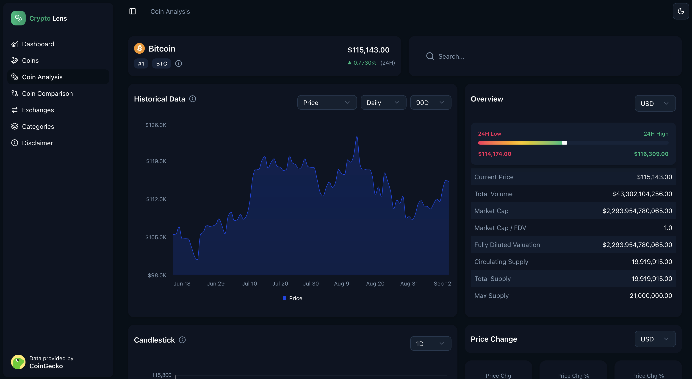
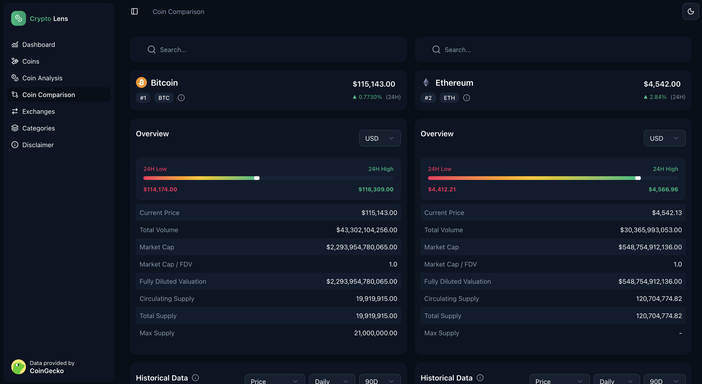

# 📊 Crypto Lens — Stock & Crypto Analytics Dashboard

[](https://crypto-lens-h.vercel.app/)

A **personal hobby project** exploring financial APIs and crypto market data.  
Built using **Next.js**, **TypeScript**, **React Query**, **TailwindCSS**, **shadcn/ui**, **Recharts**, and **ECharts**.  
The app fetches cryptocurrency market data from [CoinGecko API](https://www.coingecko.com/),  
displays price trends, OHLC charts, and other insights for traders and enthusiasts.

> ⚠️ **Disclaimer**
>
> - All cryptocurrency data is provided by the [CoinGecko API](https://www.coingecko.com/).
> - Data is **not real-time** — CoinGecko free plan enforces a **15-minute cache**.
> - This project is **not financial advice**.
> - It’s a **personal hobby project** exploring finance APIs and frontend optimizations.
> - not for financial advice!

---

## 🔗 Live Demo

🚀 **Try it out here** → [https://crypto-lens-h.vercel.app/](https://crypto-lens-h.vercel.app/)

---

## ✨ Features

- 🔹 **Crypto Market Data** — Fetches cryptocurrency price data using the CoinGecko API.
- 📈 **Interactive Charts** —
  - **ECharts** for advanced OHLC & candlestick visualizations.
  - **Recharts** for area charts and simple trend displays.
- ⚡ **Optimized Data Fetching** — Built with **React Query** for caching and API efficiency.
- 🎨 **Modern UI** — Responsive and sleek UI using **TailwindCSS** + **shadcn/ui**.
- 🌙 **Dark & Light Theme** — Seamless theme switching with `next-themes`.
- 🛠️ **TypeScript Ready** — Fully typed for better maintainability.

---

## 🖼️ Preview






---

## 🛠️ Tech Stack

- **Framework**: [Next.js](https://nextjs.org/) + [TypeScript](https://www.typescriptlang.org/)
- **Styling**: [TailwindCSS](https://tailwindcss.com/) + [shadcn/ui](https://ui.shadcn.com/)
- **Charts**: [Apache ECharts](https://echarts.apache.org/en/index.html) + [Recharts](https://recharts.org/en-US/)
- **Data Fetching**: [React Query](https://tanstack.com/query)
- **API Source**: [CoinGecko API](https://www.coingecko.com/en/api)
- **Icons**: [lucide-react](https://lucide.dev/)

---

## 🚀 Getting Started

### 1. Clone the Repository

```bash
git clone https://github.com/H-Mohamed-Hisham/crypto-lens.git
cd crypto-lens
```

### 2. Install Dependencies

```bash
npm install
```

### 3. Set Up Environment Variables

Create a .env.local file:

```
NEXT_PUBLIC_APP_URL=your_app_base_url<http://localhost:3000>
COINGECKO_BASE_URL=base_url_from_coingecko
COINGECKO_API_KEY=api_key_from_coingecko
```

### 4. Run the Development Server

```
npm run dev
```

Your app will be running at http://localhost:3000

Built with ❤️ using Next.js, React, Shadcn, Tailwind CSS, ECharts, Recharts, and CoinGecko API
